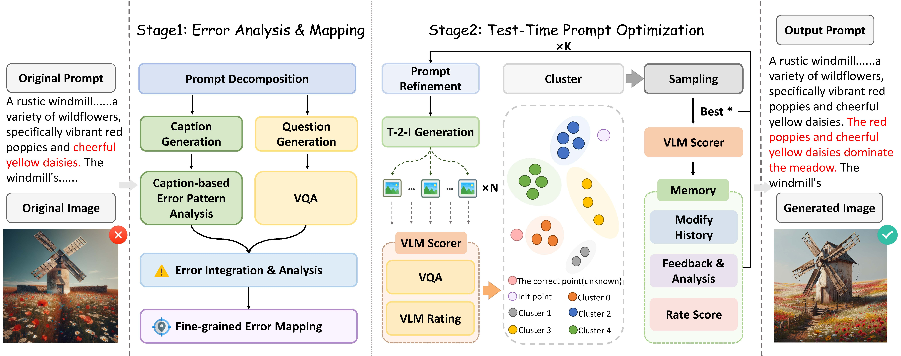
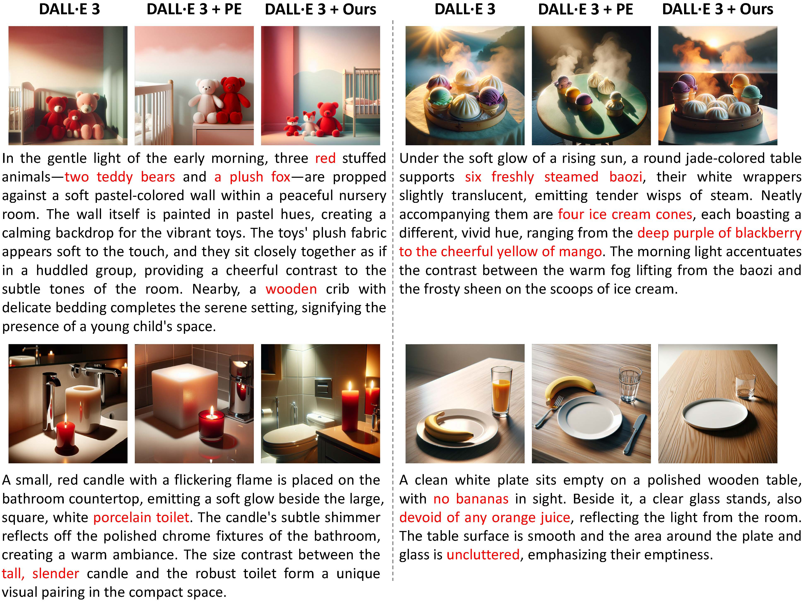

# GenPilot \[[Paper]()] EMNLP 2025 Findings

<div align="center">
  
</div>

## 🌟 Highlights
- 📚 We introduce the GenPilot, a plug-and-play multi-agent system that introduces test time scaling directly on the input prompt space for enhanced image generation, and process without any training phase, and can be broadly applied to diverse T2I models.
- 🚤 GenPilot enables precise error detection and localization via an integrated analysis strategy. A clustering-based candidate selection mechanism with posterior updates and a memory module further enhance image quality and text-image alignment by leveraging feedback across iterations.
- 🏆 Experiments on GenEval and DPG-bench outperform other methods.

## 🔨 Usage
### environment
Please refer to the requirements.txt file for setting up the environment.
```
conda create -n genpilot python==3.12
conda activate genpilot
pip install -r requirements.txt
```
#### 1. **Prepare Your Data**:
Please write the initial prompts sequentially, one prompt per line, into a .txt file named ```original_prompts.txt```. This file should be placed in the input_folder directory.

Additionally, prepare a .txt file for case IDs. For example, if you have IDs 0, 1, 2, and 3, create a file named ```0_3.txt```. This file should list these IDs, with each ID on a new line.

#### 2. **Run the Error Analysis**: 
```
bash ./error_analysis_pipline.sh
```
Please edit the information in this .sh to adjust to your models.

#### 3. **Run the Test-Time Prompt Optimization**: 
```
python ttpo.py --case_id test/0_1.txt --cuda cuda:3 --input_folder test --output_folder test --model_name [image generation model name in FLUX, sd1, sd2, sd3] --model_path [image model path] --api_key [api_key] --url [base_url] --api_model [api_model name]
```

## 🔗 Data
Patterns are available in the ```patterns.json```

## Examples
<div align="center">
  
</div>
